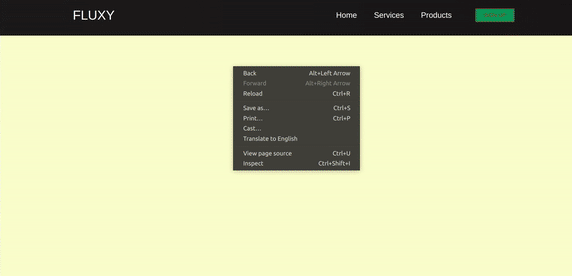

## ( in progress )

<p>WRITE your REGEX here: </p>

[](https://regex101.com/)

<br>

<p>I didnt bother to continue the tutorial due to the lack of explanation from the teacher but i got what i was looking for : </p>

[](https://nadiamariduena.github.io/react-responsive1/)

<br>

# MY FIRST RESPONSIVE REACT PORTFOLIO

```javascript

npm i react

npm i react-dom

npm i react-scripts

npm i node-sass --save

npm i autoprefixer@9.8.0

npm i gh-pages --save-dev


npm i react-router-dom
```
